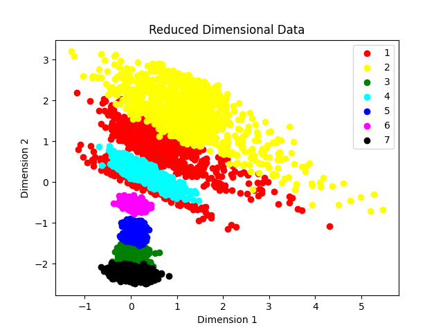

# Autoencoder-Based-2D-Representation-of-High-Dimensional-Data
本專案實作一個 **自動編碼器（Autoencoder）多層神經網絡的一種非監督式學習算法**
---

## 專案目標

- 訓練一個 Autoencoder，學習資料的低維特徵表示
- 於模型訓練完成後，取用 Autoencoder 的 bottleneck 層作為特徵嵌入，
  藉此將高維度資料映射至 2D 空間以進行分析與視覺化
---

## 專案結構

```
.
├── clsn1_trn.csv            # 訓練資料集（最後一欄為類別標籤）
├── reduced_dim.csv           # 降維結果
│
├── report3.h5               # 訓練完成的autoecoder
│
├── auto.py                  #source code
└── README.md                # 專案說明文件
```

---

## 方法概述（Methodology）

### 資料處理
- 分類標籤位於每筆資料的最後一個欄位
- 對訓練資料之輸入特徵進行標準化處理，以提升模型訓練穩定性與收斂速度
- 訓練資料與測試資料分開處理，並以訓練資料計算之標準化參數套用於測試資料，以避免資料洩漏

### 模型架構
模型採用對稱式 Encoder–Decoder 架構，結構如下：

輸入層
維度：N（經標準化後的特徵數）
Encoder（編碼器）
Dense（27 個神經元，ReLU）
Dense（7 個神經元，ReLU）
Bottleneck 層：Dense（2 個神經元，Linear）
Decoder（解碼器）
Dense（7 個神經元，ReLU）
Dense（27 個神經元，ReLU）
Dense（N 個神經元，Linear）

### 訓練設定
- 損失函數：Mean Squared Error
- 最佳化方法：Adam Optimizer

---

## 使用方式（如有提供原始碼）

```bash
python auto.py
```

執行後將完成：
1. 載入並前處理訓練資料
2. 建立降維分類模型
3. 使用測試資料進行推論
4. 儲存降為分類結果至 `reduced_dim.csv`
5. 儲存模型至 `report3.h5`

---

## 輸出結果說明

### `reduced_dim.csv`
- 包含降維後的維度輸出
- 以及模型對應的分類預測結果(最後一行)
- 每一列對應一筆測試樣本的結果
### 1) 7個類別在平面上的分布狀況（MAE)（Figure 1）


**說明：**
- The colors for different 
classes are as follows: class1(red), class 2(yellow), class 3(green), class 4(cyan), class 
5(blue), class 6(magenta), class 7(black).

---

## 環境需求

- Python 3.x
- TensorFlow / Keras
- NumPy
- Pandas

---
